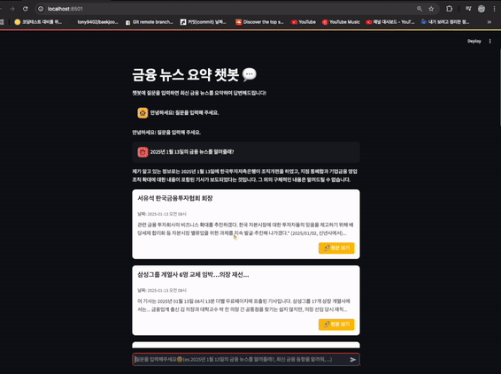

<!-- * [데이터 리차드 포트폴리오를 참고하려면?](https://dongchanlim.github.io/github-portfolio/)
* [무료 이미지 사이트](https://unsplash.com/)-->

## 📊 자기 소개 (Introduction)
### 안녕하세요. 데이터 분석 및 머신러닝을 기반으로 부동산 분석 및 LLM활용 , 모델 최적화까지 아우르는 데이터 기반 솔루션을 구축하는 신입 데이터 사이언티스트 구경덕입니다.
------

<!-- - 한줄 자기소개 
예시)"데이터 분석에 뛰어난 역량과 실무 경험을 갖춘 데이터 엔지니어로, 복잡한 문제에 효과적인 솔루션을 제시합니다."-->
> 
>
> 
> 

## 📊 직무 경험 (Experience)
**반도체배관 생산** @ 비비테크 & 한양이엔지 (2023/03 - 2023/11)

- 효율적인 배관 관리 및 최적화 작업력을 바탕으로 설비당 Leak (배관누수) 및 불량시공 비율 5% 이하 달성 
- ISO 매트릭을 활용한 철저한 배관 실측 및 최적의 동선 설계를 기반으로 공간 활용도 극대화

**E-커머스 영업** @ 큐소닉 (2019/12 - 2023/02)

- 온라인마켓 MD와 원활한 커뮤니케이션을 통한 신규 거래처 확보 및 장기적 파트너십 구축으로 스마트모니터 판매증가량 400% 달성
- 수금일정 관리 및 매 ‘주’단위 정산비용 체크를 통한 정산 담당기간동안 미수금 zero 달성 

**부동산 영업** @ 두바이 부동산중개법인 (2019/01 - 2019/10)

- 효과적인 커뮤니케이션 스킬과 협상 능력을 바탕으로 매매시작 3일만에 계약 달성
- 매도자와 원활한 거래 중개 및 협상 능력을 바탕으로 매물등록 건수 월 35건으로 팀내 1위 달성
------

## 📊 교육 (Education)
🏫 신한대학교 (2015.07 - 2018.08)

- 측량 전공 & 토지행정학과

🏫 신흥대학교 (2011.03 - 2015.07)

- 부동산 전공 & 지적부동산학과
------

## 📊 보유 스킬 (Skill)
- Python - Pandas, Numpy, Matplotlib, Sklearn, Seaborn, Crawling, Geo
- SQL - DBMS, RDBMS
- LLM - RAG , Streamlit
- Cloud - GCP , Google maps API
- archive - Github , Notion
------

## 📊 프로젝트 (Project)

[LLM & RAG: AI 기반 금융 뉴스 요약 솔루션](https://github.com/Kyungdeok-Koo/FinPin_Langchain)
- 금융키워드를 검색했을때 여러 뉴스 사이트에서 제공하는 데이터셋(네이버, 구글 등)을 기반으로 금융 뉴스를 요약해주는 솔루션을 제공하였습니다.

[뉴욕시 에어비엔비 태블로 분석](https://public.tableau.com/app/profile/dongchan.lim/viz/AirbnbPractice_15699654202660/Story1)
- 뉴욕시에 있는 에어비엔비의 데이터를 시각화하여 고객들이 숙소 가격 과 평점을 한눈에 보고 비교할 수 있어요!

[뉴욕시 에어비엔비 태블로 분석](https://public.tableau.com/app/profile/dongchan.lim/viz/AirbnbPractice_15699654202660/Story1)
- 뉴욕시에 있는 에어비엔비의 데이터를 시각화하여 고객들이 숙소 가격 과 평점을 한눈에 보고 비교할 수 있어요!
------
